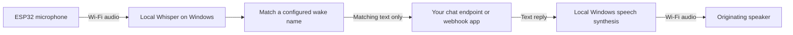

# WiFi Speaker

Turn a supported ESP32 speaker into a voice interface for an **OpenAI-compatible chat endpoint** or **your own webhook application**. A Rust Windows tray app handles local speech-to-text (STT), sends matching prompts to your chosen backend, and turns replies into speech with local text-to-speech (TTS). The ESP32 provides the microphone and speaker over Wi-Fi.

Choose a wake name, connect multiple speakers, give each a name and room tags, and save independent microphone gain and playback volume. Requests carry the originating speaker's identity so replies return to the right room.

This is a source release. Build the portable desktop app and firmware as described below. No accounts, LLM service, deployment addresses or credentials are included.

[Requirements](#requirements) · [Build](#build-on-windows) · [Hub settings](#set-up-the-hub) · [Speaker setup](#install-a-muse-luxe) · [First conversation](#check-your-first-conversation) · [Application API](#connect-your-application) · [Troubleshooting](#troubleshooting) · [Contributing](#development-and-contributions)

## How it works



The hub buffers and transcribes detected phrases before checking for a whole-word wake name anywhere in the sentence. Both “Speaker, tell me a joke” and “Tell me a joke, Speaker” can activate it. This is continuous local phrase recognition, rather than a dedicated wake-word model. The PC and tray app must remain running and awake.

## Requirements

| Component | What you need |
| --- | --- |
| Desktop | Windows 10/11 x64, Microsoft WebView2, and an installed Windows speech voice |
| Speaker | Original **RASPIAUDIO Muse Luxe**, with ESP32, ES8388 codec and 4 MB flash |
| Network | 2.4 GHz Wi-Fi for the speaker, with network access to the Windows PC; the PC may use Ethernet |
| Reply backend | An OpenAI-compatible chat-completions endpoint and model, or an app implementing the [webhook API](docs/API.md) |
| Initial installation | USB data cable and the device's COM port in Windows Device Manager |

Other ESP32 speaker boards need a firmware port for their codec, pins and flash layout. Do not flash this Muse Luxe image onto a different board. See [hardware support and porting](docs/hardware.md).

Local speech recognition uses the English Whisper `base.en` model by default. Your LLM is a separate service that you supply; it may run locally or remotely. Local STT and TTS do not require a cloud speech account. Initial dependency/model downloads and any remote backend need internet access.

## Build on Windows

Install Git, Python 3.11 or newer, the Rust stable **MSVC** toolchain, and Visual Studio Build Tools with **Desktop development with C++** and CMake. Download and extract this repository using **Code > Download ZIP**, or clone its HTTPS URL with Git. Open PowerShell in the repository directory:

```powershell
# Install pinned build helpers in this checkout's .tools directory.
.\scripts\bootstrap.ps1

# Test, then build the desktop app and command-line hub.
.\scripts\build.ps1 -Test
.\scripts\build.ps1 -Release

# Download the local English speech-recognition model.
.\target\release\speaker-hub.exe --download-model .\models

# Build the Muse Luxe image without touching a connected device.
.\scripts\firmware.ps1 -Action Build

# Assemble the portable desktop folder.
.\scripts\package.ps1
```

Cargo and PlatformIO download their dependencies. The model download is approximately 148 MB and verifies both size and SHA-256. Alternatively, download it later using **Download base.en** in the app.

Open `artifacts/Smart Speaker/Smart Speaker.exe`. Keep the complete portable folder together, including its `models` directory when present. Rust and Python are build dependencies; the portable desktop app does not need them to run. It still requires WebView2 and a Windows speech voice. The package's relative paths and hashes are listed in `artifacts/desktop-sha256.json`.

Packaging requires an empty destination. To preserve an existing package when rebuilding:

```powershell
.\scripts\package.ps1 -OutputDirectory .\artifacts\next-build
```

For development checks and optional speech/UI tests, see [verification](docs/verification.md).

## Set up the hub

1. Launch the app and open **Connections**. Choose **OpenAI-compatible chat** or **App webhook**. Enter the complete prompt destination URL and its optional bearer token. Chat mode also needs the model ID offered by your endpoint.
2. Set **PC address reachable by speakers and apps** to this PC's LAN address and port. Leave **Listen URL** at `http://0.0.0.0:48490` unless you need another interface or port. The initial public address uses loopback and must be changed for physical speakers.
3. In **Voice & listening**, select the local Whisper model and an installed Windows voice. Choose wake names or alternate spellings, separated by commas. The initial name is **Speaker**.
4. In **Speakers**, add a device, choose a name and tags, and **save settings**. Open its **Setup details** for the permanent device ID and generated device token. Register each physical speaker separately.
5. Allow the app's listening port through Windows Firewall on the **Private** network used by the speakers. The optional [LAN helper](docs/installation.md#lan-access) accepts your executable and port.

The different addresses have different jobs:

| Setting | Meaning | Example |
| --- | --- | --- |
| Prompt destination URL | Where the PC sends recognized text | `https://llm.example.com/v1/chat/completions`, or your app's prompt endpoint |
| Listen URL | The PC interface and port accepting speaker and app connections | `http://0.0.0.0:48490` listens on the PC's interfaces |
| PC address reachable by speakers and apps | The PC address used by devices and included in callback/audio URLs | `http://192.0.2.10:48490`, replacing the example IP with your PC's LAN IP |
| Response callback URL | The fixed response path on that public address | `http://192.0.2.10:48490/v1/responses` |

`llm.example.com` and `192.0.2.10` are documentation placeholders. `127.0.0.1` works only on the PC itself, and `0.0.0.0` is a listen address, not an address to enter on the speaker. A chat endpoint uses the complete `/v1/chat/completions` path, not just a server's home page.

Closing Settings keeps the tray app running. Right-click the tray icon to pause listening or exit. **Start with Windows** is optional. Saving settings disconnects speakers and clears current requests; speakers reconnect automatically.

## Install a Muse Luxe

Use a USB data cable, turn on the speaker, and locate its COM port. Install the Silicon Labs CP210x driver if needed, and close serial terminals using the port. **COM7 below is a placeholder**; replace it with the actual port:

```powershell
.\scripts\firmware.ps1 -Action Flash -Port COM7
```

The script makes and verifies a complete 4 MB backup before writing. **Flash replaces existing firmware and provisioning.** Keep the private backup for recovery and do not disconnect power during writing.

After flashing:

1. Join the device's `Speaker-setup-…` Wi-Fi network using password `speaker-setup`.
2. Open `http://192.168.4.1` in a browser.
3. Enter your 2.4 GHz Wi-Fi name/password and the hub URL, device ID and device token from the saved desktop **Setup details**.
4. Save. The speaker restarts and connects to the hub. Reconnect your computer to its usual network if you used its Wi-Fi for provisioning.

Wi-Fi and device credentials are stored in the speaker's flash. The setup access point closes after ten minutes; hold the middle button for five seconds to reopen it. If joining its Wi-Fi is inconvenient, the setup dialog and [USB provisioning instructions](docs/installation.md#provisioning) provide an alternative.

For later firmware updates **after installing this project's partition layout**, use:

```powershell
.\scripts\firmware.ps1 -Action Update -Port COM7
```

**Update** takes a full backup, writes only the application, verifies it and preserves Wi-Fi/device credentials. Use **Flash** for first installation. [Installation and troubleshooting](docs/installation.md) covers backups, restoration, USB setup and LED indicators.

## Check your first conversation

1. Wait for the speaker to show online/listening, then select **Test voice**. This checks TTS and playback without needing an LLM reply.
2. Watch its microphone meter while speaking. Say “Speaker, tell me a short joke,” using your configured wake name.
3. The request should progress through transcription, waiting for the backend, speech synthesis, playback and back to listening. Listen to the reply and check the speaker card for an error if it does not complete.

Each speaker card has **Microphone gain** (0.25x to 8x) and **Playback volume** (0 to 100%). Adjust gradually and save. Gain raises audio used for recognition after phrase detection; the global speech threshold controls whether quiet raw microphone audio starts a phrase. See [audio tuning](docs/installation.md#check-sound-and-listening).

A short middle-button press mutes/unmutes the microphone. Plus/minus changes the device's current volume; reconnecting restores the saved desktop volume. Names are for display, permanent IDs route replies, and tags let an app address rooms or groups.

## Connect your application

**OpenAI-compatible chat** sends `model`, `max_tokens`, `stream: false`, and system/user messages to your configured URL. It reads reply text from `choices[0].message.content`. The system context includes the PC's current date, time and UTC offset. The adapter is stateless, with no retained chat history. Optional custom caller-header routing is configured locally and disabled by default.

**App webhook** sends the recognized phrase, request ID, originating speaker ID/name/tags, and response callback URL. Your app can return HTTP 200 with `{"text":"Your reply"}` immediately, or HTTP 202 and send a correlated response later. Your app owns any conversation history.

| API | Purpose |
| --- | --- |
| `POST /v1/responses` | Reply to a pending request with matching `request_id`, `speaker_id` and `text` |
| `POST /v1/speak` | Send an announcement to explicit speaker IDs, tags, or both |
| `GET /v1/speakers` | Read connectivity, processing state, microphone levels and errors |

Apps calling these routes use the **app API token** from Connections. Each physical device has its own **device token** for microphone/audio transport. The optional **destination bearer token** authenticates requests to your backend. These credentials have separate roles; the callback token is never included in outbound prompts.

The [API guide](docs/API.md) contains complete JSON examples, authentication rules, deferred replies, timeouts, duplicate handling, microphone diagnostics and the WebSocket protocol for additional speaker types.

## Local settings and privacy

Endpoint URLs, API keys, model selection, routing headers, wake names, audio adjustments and device registrations live in `%APPDATA%/com.smartspeaker.desktop/settings.json`. The app generates fresh API tokens locally. This file is not encrypted; keep it private and back it up before moving or replacing an installation. `SMART_SPEAKER_CONFIG_DIR` selects an alternative private settings directory.

Normal operation keeps audio and transcripts in memory. Only phrases matching a configured wake name go to your selected backend. A remote backend receives that text and may apply its own storage policy. Explicit diagnostics can expose speech to the caller. Settings, recordings, flash backups, models and build output must stay out of public commits. See [privacy and security](SECURITY.md).

## Behavior and limits

- Recognition is phrase-based and uses CPU even for speech without a wake name. Speed and practical speaker count depend on the PC, model and room activity.
- Up to 32 speakers can be registered. Each keeps at most two completed phrases waiting for recognition and one reply in flight.
- Listening audio is ignored while a reply is pending or playing. There is no acoustic echo cancellation or barge-in. Mute, pause, reconnect and playback discard queued listening audio.
- Reply audio is 16 kHz mono PCM, limited to three minutes. Announcements to multiple speakers are not synchronized multiroom music playback.
- Speaker transport is authenticated HTTP/WebSocket on a trusted LAN. Keep the hub port off the public internet. The current speaker client does not implement HTTPS termination.

## Troubleshooting

| Symptom | Check first |
| --- | --- |
| No COM port | Speaker power, USB data cable, CP210x driver and another program holding the port |
| No setup Wi-Fi | Hold the middle button for five seconds; the setup window expires after ten minutes |
| Speaker stays offline | Saved device ID/token, reachable PC address, 2.4 GHz Wi-Fi, firewall and guest/IoT network isolation |
| Meter moves but no reply | Configured wake name, speech model, raw speech threshold, prompt URL/model/token and the speaker's error status |
| Quiet input or playback | That speaker's saved gain/volume, mute state and selected Windows voice |
| Reply takes a long time | Transcription load, backend response time, response timeout and other active speakers |
| Package command refuses to overwrite | Use an empty `-OutputDirectory` and keep the existing package for rollback |

For deeper diagnosis, follow [installation and troubleshooting](docs/installation.md) and the [explicit microphone tests](docs/API.md#explicit-microphone-sample). A successful playback acknowledgement proves the stream finished, not that it sounded clear in the room.

## Development and contributions

All changes to `main` go through a pull request and require approval from the repository owner listed in `.github/CODEOWNERS`. New changes dismiss earlier approvals. The Windows verification check must pass against the current base branch, and review conversations must be resolved. The rule applies to administrators too, with no bypass accounts; force pushes and branch deletion are blocked.

Fork the project, make a focused branch and open a PR. The [contribution guide](CONTRIBUTING.md) explains review and validation, including GitHub's restriction on approving your own PR. See [verification](docs/verification.md) for checks and [dependency notices](docs/dependencies.md) for third-party attribution.

| Directory | Purpose |
| --- | --- |
| `crates/hub` | Rust audio processing, speech, HTTP/WebSocket API and CLI |
| `desktop`, `ui` | Tauri tray app and bundled settings interface |
| `firmware` | Muse Luxe audio, Wi-Fi, provisioning and transport |
| `scripts` | Build, package, firmware, simulator and diagnostic helpers |
| `docs` | Protocol, installation, hardware and third-party notices |

Project code is [MIT licensed](LICENSE). Dependencies retain their own licenses.
